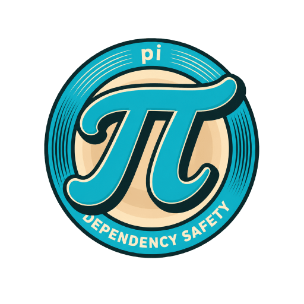

<p align="center">
  
</p>

# npm-dependency-safety

Pi skill package for reviewing dependency-impacting Node.js work across npm-registry-compatible package managers.

Use it before project initialization, feature development that may add packages, package additions, package updates, package-manager migration, or changes to `package.json`, lockfiles, npm/pnpm/yarn/bun settings, or workspace dependency policy.

## Install

Package name: `pi-dependency-safety`

```bash
pi install npm:pi-dependency-safety
```

For local package testing from this package directory:

```bash
pi install ./
```

For temporary skill-file testing without installing the package:

```bash
pi --skill ./skills/npm-dependency-safety
```

From another repository, pass the absolute path to this skill directory:

```bash
pi --skill /absolute/path/to/pi-dependency-safety/skills/npm-dependency-safety
```

## What it checks

- npm-registry package risk before adding or updating dependencies.
- CVEs, OSV/GitHub advisories, package-manager audit data, issue trackers, Socket.dev reports, and recent supply-chain signals.
- Package metadata risk signals including lifecycle scripts, binaries, dependency graph shape, maintainers, publish time, and deprecation.
- Package-manager policy for npm, pnpm, yarn, bun, and mixed setups.
- Existing Dependabot/Renovate/CI/scanner automation as evidence, not a substitute for pre-change review.
- pnpm dependency build script controls such as approved/blocked builds and strict dependency-build behavior.
- Privacy/network approval before external lookups for private repos or unknown policy.

## Structure

```text
skills/npm-dependency-safety/
├── SKILL.md
└── references/
    ├── orchestration.md
    ├── package-manager-checks.md
    ├── package-policy.md
    ├── pnpm-hardening.md
    ├── report-format.md
    └── risk-review.md
```

## Maintainer publishing notes

Publish only after validating package contents:

```bash
npm pack --dry-run --json
npm publish --access public
```

If publishing under a scope, update `package.json` and this README before publishing, then use the scoped package name in the install command.

## License

Apache-2.0. Copyright 2026 ludevdot.
